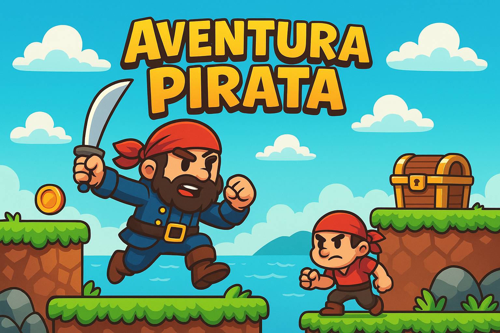

# 🏴‍☠️ Aventura Pirata

**Aventura Pirata** é um jogo de plataforma 2D desenvolvido com **Pygame Zero**. Nele, você controla um pirata destemido em busca de tesouros escondidos enquanto enfrenta inimigos e obstáculos em uma ilha misteriosa. O objetivo é coletar todos os tesouros sem ser derrotado pelos inimigos.

  

## 🎮 Como jogar

- **Setas esquerda/direita**: mover o pirata
- **Seta para cima**: pular
- **Coletar** todos os tesouros para vencer a fase
- **Evite os inimigos** ou será derrotado!
- **ESC**: voltar ao menu na tela de vitória
- **Clique nos botões do menu** para iniciar o jogo ou desligar o som

---

## 🛠 Tecnologias utilizadas

- 🐍 Python
- 🎮 [Pygame Zero](https://pygame-zero.readthedocs.io/en/stable/)
- 🔊 Sons e sprites personalizados

---

## 🧠 Conceitos aplicados

- Física de plataformas (gravidade, pulo, colisão com chão)
- Animação por sprites
- Estados de jogo (menu, jogando, vitória)
- Detecção de colisão com `Rect`
- Programação orientada a objetos (POO)
- Sistema de pontuação e som

---

## ▶️ Como executar

### Pré-requisitos:
- Python 3 instalado
- Pygame Zero instalado:  

### Rodando o jogo:
1. Baixe ou clone este repositório: https://github.com/GTNFelipe/Aventura_pirata
2. Execute o jogo com: pgzrun aventura_pirata.py

---

## 📁 Estrutura do projeto

Aventura pirata - KODLAND/
│
├── roguelike.py # Código principal do jogo
├── images/ # Pasta com sprites e animações
│ ├── enemy_idle_left_0.png
│ ├── enemy_idle_left_1.png
│ └── ...
├── sounds/ # Sons do jogo
│ ├── music.wav
│ └── coin.wav
└── README.md # Este arquivo

---

## 🧩 Possíveis melhorias futuras

- Adição de múltiplas fases
- Sistema de vidas
- Menu de pausa
- Interface gráfica com pontuação e barra de progresso
- Suporte para joystick

---

## 🧑‍💻 Autor

**Felipe**  
Estudante de Análise e Desenvolvimento de Sistemas na Unisuam  
Desenvolvido como projeto prático para processo seletivo em Python e desenvolvimento de jogos com Pygame Zero.

---

## 📜 Licença

Este projeto é de código aberto e pode ser usado para fins educacionais.

   
